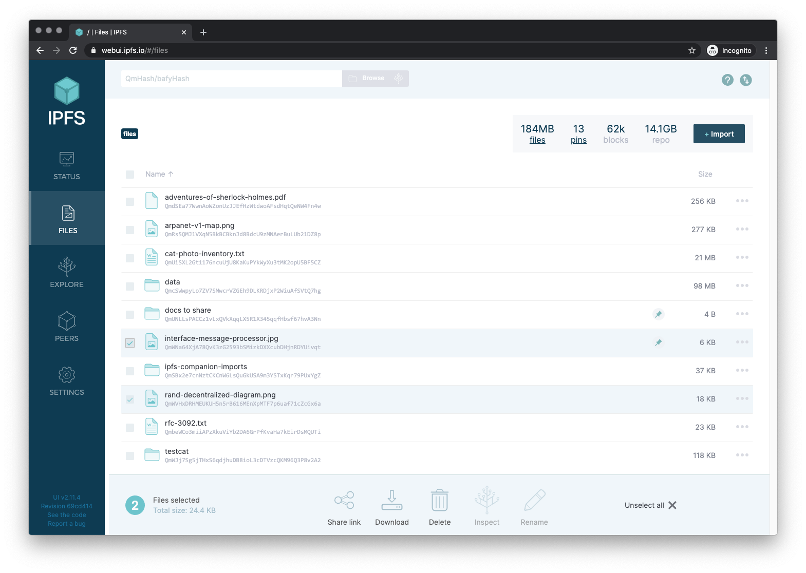
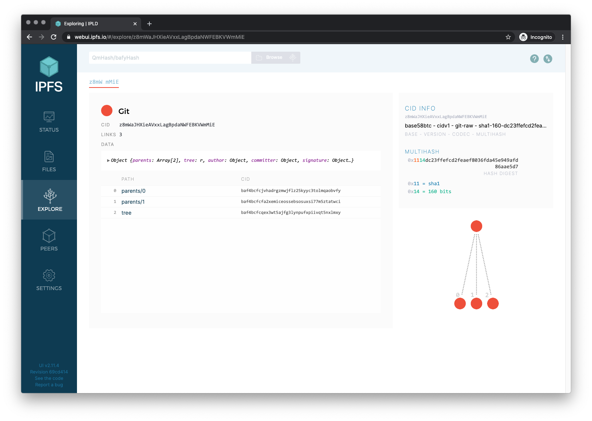
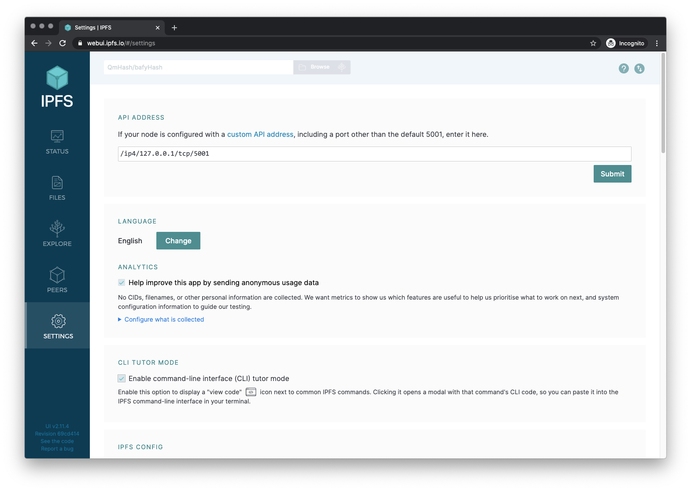

# IPFS Web UI

> A web interface to [IPFS](https://ipfs.io).
>
> Check on your node stats, explore the IPLD powered merkle forest, see peers around the world and manage your files, without needing to touch the CLI.


| Files | Explore | Peers | Settings |
|-------|---------|-------|----------|
|  |  |  |  |


[](https://protocol.ai/) [](http://webchat.freenode.net/?channels=%23ipfs) [](https://david-dm.org/ipfs-shipyard/ipfs-webui/revamp) [](https://circleci.com/gh/ipfs-shipyard/ipfs-webui)

The IPFS WebUI is a **work-in-progress**. Help us make it better! We use the issues on this repo to track the work and it's part of the wider [IPFS GUI project](https://github.com/ipfs/ipfs-gui).

The app uses [`ipfs-http-client`](https://github.com/ipfs/js-ipfs-http-client) to communicate with your local IPFS node.

The app is built with [`create-react-app`](https://github.com/facebook/create-react-app). Please read the [docs](https://github.com/facebook/create-react-app/blob/master/packages/react-scripts/template/README.md#table-of-contents).

## Install

With `node` >= 10 and `npm` >= 6.4.1 installed, run

```sh
> npm install
```

## Usage

**When working on the code**, run an ipfs daemon, the local [dev server](https://github.com/facebook/create-react-app/blob/master/packages/react-scripts/template/README.md#npm-start), the [unit tests](https://facebook.github.io/jest/), and the [storybook](https://storybook.js.org/) component viewer and see the results of your changes as you save files.

In separate shells run the following:

```sh
# Run IPFS
> ipfs daemon
```

```sh
# Run the dev server @ http://localhost:3000
> npm start
```

```sh
# Run the unit tests in watch mode
> npm run test:unit:watch
```

```sh
# Run the UI component viewer @ http://localhost:9009
> npm run storybook
```

### Configure IPFS API CORS headers

You must configure your IPFS API at http://127.0.0.1:5001  to allow [cross-origin (CORS)](https://developer.mozilla.org/en-US/docs/Web/HTTP/CORS) requests from your dev server at http://localhost:3000

Similarly if you want to try out pre-release versions at https://dev.webui.ipfs.io you need to add that as an allowed domain too.

#### Easy mode

Run the **[cors-config.sh](./cors-config.sh)** script with:

```sh
> ./cors-config.sh
```

#### The manual way

```sh
> ipfs config --json API.HTTPHeaders.Access-Control-Allow-Origin '["http://localhost:3000", "https://webui.ipfs.io", "http://127.0.0.1:5001"]'
> ipfs config --json API.HTTPHeaders.Access-Control-Allow-Methods '["POST"]'
```

#### Reverting

To reset your config back to the default configuration, run the following command.

```sh
> ipfs config --json API.HTTPHeaders {}
```

You might also like to copy the `~/.ipfs/config` file somewhere with a useful name so you can use `ipfs config replace <file>` to switch your node between default and dev mode easily.

## Running with Docker

If you need to run IPFS in a Docker container, you can still have Web UI available by exposing both the Gateway and Web UI ports.

Using the default ports:

```sh
docker pull ipfs/go-ipfs
docker run -p 8080:8080 -p 5001:5001 -it ipfs/go-ipfs
```

See the [go-ipfs page](https://hub.docker.com/r/ipfs/go-ipfs) on Docker Hub to get started using IPFS with Docker.

## Build

To create an optimized static build of the app, output to the `build` directory:

```sh
# Build out the html, css & jss to ./build
> npm run build
```

## Test

The following command will run all tests: unit one for React and E2E against real HTTP API:

```sh
> npm test
```

## Unit tests

To watch source files and re-run the tests when changes are made:

```sh
> npm run test:unit
```

The WebUI uses Jest to run the isolated unit tests. Unit test files are located next to the component they test and have the same file name, but with the extension `.test.js`

## E2E tests

The end-to-end tests (E2E) test the full app in a headless Chromium browser. They spawn real IPFS node for HTTP API and a static HTTP server to serve the app.
The purpose of those tests is not being comprehensible, but act as a quick regression and integration suite.
Test files are located in `test/e2e/`.

Make sure `npm run build` is run before starting E2E tests:

```sh
> npm run build
> npm run test:e2e # end-to-end smoke tests (fast, headless, use go-ipfs)
```

### Customizing E2E Tests

Default behavior can be tweaked via env variables below.

#### `E2E_IPFSD_TYPE`

Variable named `E2E_IPFSD_TYPE` defines which IPFS backend should be used for end-to-end tests.

CI setup of ipfs-webui repo runs tests against both JS and GO implementations:

```sh
> E2E_IPFSD_TYPE=go npm run test:e2e # 'go' is the default if missing
> E2E_IPFSD_TYPE=js npm run test:e2e
```

##### Overriding versions

It is possible to test against arbitrary versions by tweaking `ipfs` (js-ipfs)
 and `go-ipfs` in `devDependencies` section of `package.json` and applying the change via `npm i`
 
One can also override the binary used in e2e tests by providing a path to an alternative one via `IPFS_GO_EXEC` (or `IPFS_JS_EXEC`):

```sh
> IPFS_GO_EXEC=$GOPATH/bin/ipfs  npm run test:e2e
> E2E_IPFSD_TYPE=js IPFS_JS_EXEC=/path/to/jsipfs  npm run test:e2e
```

#### `E2E_API_URL`

Instead of spawning a disposable node and repo for tests, one can point the E2E test suite at arbitrary HTTP API running on localhost:

```sh
> E2E_API_URL=http://127.0.0.1:5001 npm run test:e2e
```

**Caveat 1:** HTTP API used in tests needs to run on the local machine for Peers screen to pass (they test manual swarm connect to ephemeral `/ip4/120.0.0.1/..` multiaddr)

**Caveat 2:** CORS requests from `http://localhost:3001` (static server hosting dev version of webui) need to be added to `Access-Control-Allow-Origin` whitelist array in node's config:

```json
"API": {
  "HTTPHeaders": {
    "Access-Control-Allow-Methods": ["POST"],
    "Access-Control-Allow-Origin": [
      "http://localhost:5001",
      "http://localhost:3001"
    ]
  }
}
```

Can be done ad-hoc via command line:

```sh
> ipfs config --json API.HTTPHeaders.Access-Control-Allow-Origin '["http://localhost:3001", "http://127.0.0.1:5001"]'
> ipfs config --json API.HTTPHeaders.Access-Control-Allow-Methods '["POST"]'
```

### Debugging E2E tests

#### Show the browser

By default, the test run headless, so you won't see the browser. To debug test errors, it can be helpful to see the robot clicking around the site.
To disable headless mode and see the browser, set the environment variable `DEBUG=true`:

```sh
> DEBUG=true npm run test:e2e # e2e in slowed down mode in a browser window
```

#### Breakpoints

It is possible to set a "breakpoint" via `await jestPuppeteer.debug()` to stop tests at a specific line:

```js
jest.setTimeout(600000) // increase test suite timeout
await jestPuppeteer.debug() // puppeteer will pause here
```

In a **continuous integration** environment we lint the code, run the unit tests, build the app, start an http server and run the unit e2e tests:

```sh
> npm run lint
> npm test
> npm run build
> npm run test:e2e
```

## Coverage

To do a single run of the tests and generate a coverage report, run the following:

```sh
> npm run test:coverage
```

## Lint

Perform [`standard`](https://standardjs.com/) linting on the code:

```sh
> npm run lint
```

## Analyze

To inspect the built bundle for bundled modules and their size, first `build` the app then:

```sh
# Run bundle
> npm run analyze
```

## Translations

One can permanently switch to a different locale via _Settings_ or temporarily via `?lng=<lang-code>` URL parameter.

The translations are stored on [./public/locales](./public/locales) and the English version is the source of truth. We use Transifex to help us translate WebUI to another languages.

**If you're interested in contributing a translation**, go to [our page on Transifex](https://www.transifex.com/ipfs/ipfs-webui/translate/), create an account, pick a language and start translating. Be sure to change your notification settings to be notified when translation sources change.

You can read more on how we use Transifex and i18next in this app at [`docs/LOCALIZATION.md`](docs/LOCALIZATION.md)

## Releasing

1. Run `tx pull -a` to pull the latest translations from Transifex ([i18n#transifex-101)](https://github.com/ipfs-shipyard/i18n#transifex-101))
1. If UI is materially different, update screenshots in `README.md` and on docs.ipfs.io [here](https://docs.ipfs.io/how-to/command-line-quick-start/#web-console)
1. Update the version (`npm version [major|minor|patch]`)
1. Push the changes (`git push && git push --follow-tags`)
1. Wait for the tag to [build on CI](https://circleci.com/gh/ipfs-shipyard/ipfs-webui), and grab the CID produced from the tagged commit
1. Add release notes to https://github.com/ipfs-shipyard/ipfs-webui/releases, use the tag and CID you created 
1. Update `CHANGELOG.md` with changes from release notes
1. Update the CID at projects that use ipfs-webui by submitting PR against below lines:
   - js-ipfs: https://github.com/ipfs/js-ipfs/blob/master/packages/ipfs-http-server/src/api/routes/webui.js#L8
   - go-ipfs: https://github.com/ipfs/go-ipfs/blob/master/core/corehttp/webui.go#L4
   - ipfs-desktop: https://github.com/ipfs-shipyard/ipfs-desktop/blob/master/package.json#L18

## Contribute

Feel free to dive in! [Open an issue](https://github.com/ipfs-shipyard/ipfs-webui/issues/new) or submit PRs.

To contribute to IPFS in general, see the [contributing guide](https://github.com/ipfs/community/blob/master/CONTRIBUTING.md).

[](https://github.com/ipfs/community/blob/master/CONTRIBUTING.md)

## Browser and device testing

[](https://www.browserstack.com/)

We would like to thank [BrowserStack](https://www.browserstack.com/) for supporting Open Source and making it possible to test the IPFS Web UI on a wide array of operating systems and devices, improving compatibility for everyone.

## License

[MIT](LICENSE) © Protocol Labs
